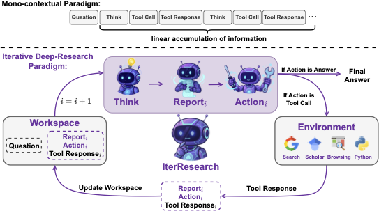
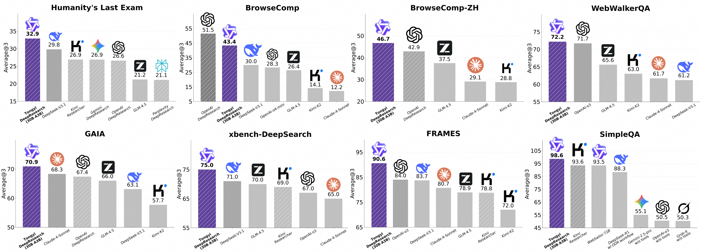

# WebResearcher: An Iterative Deep-Research Agent

<p align="center">
  
</p>

<p align="center">
  <strong>Unbounded Reasoning Through Iterative Synthesis</strong>
</p>

<p align="center">
  <a href="https://pypi.org/project/webresearcher/"></a>
  <a href="https://pypi.org/project/webresearcher/"></a>
  <a href="https://github.com/shibing624/WebResearcher/blob/main/LICENSE"></a>
  <a href="https://arxiv.org/abs/2509.13309"></a>
  <a href="https://pepy.tech/project/webresearcher"></a>
</p>

<p align="center">
  <a href="./README.md">English</a> | <a href="./README_zh.md">简体中文</a>
</p>

---

## 🌟 Highlights

- 🧠 **Iterative Deep-Research**: Novel paradigm that prevents context overflow through periodic synthesis
- 🔄 **Unbounded Reasoning**: Practically unlimited research depth via evolving summary reports
- 🛠️ **Rich Tool Ecosystem**: Web search, academic papers, code execution, file parsing
- 🎯 **Production Ready**: Zero external agent framework dependencies, fully self-contained
- ⚡ **High Performance**: Async-first design, smart token management, robust error handling
- 🎨 **Easy to Use**: Simple CLI, clean Python API, extensive examples

## 📖 Introduction

**WebResearcher** is an autonomous research agent built on the **IterResearch paradigm**, designed to emulate expert-level research workflows. Unlike traditional agents that suffer from context overflow and noise accumulation, WebResearcher breaks research into discrete rounds with iterative synthesis.

### The Problem with Traditional Agents

Current open-source research agents rely on **mono-contextual, linear accumulation**:

1. **🚫 Cognitive Workspace Suffocation**: Ever-expanding context constrains deep reasoning
2. **🚫 Irreversible Noise Contamination**: Errors and irrelevant info accumulate
3. **🚫 Lack of Synthesis**: No pausing to distill, re-evaluate, and plan strategically

### The WebResearcher Solution

WebResearcher **deconstructs research into discrete rounds**, each producing:

- **Think**: Internal reasoning (discarded after synthesis to prevent clutter)
- **Report**: Evolving central memory with synthesized insights
- **Action**: Tool call or final answer

This enables **unbounded research depth** while maintaining a lean, focused cognitive workspace.

<p align="center">
  
  <br>
  <em>Figure: Mono-contextual Paradigm (Top) vs. Iterative Deep-Research Paradigm (Bottom)</em>
</p>

## 🏗️ Architecture

### Core Components

```python
┌─────────────────────────────────────────────┐
│  Workspace (Persistent State)               │
│  ├─ Question (Fixed)                        │
│  ├─ Report (Evolving)                       │
│  └─ Last Tool Result                        │
└─────────────────────────────────────────────┘
              ↓
┌─────────────────────────────────────────────┐
│  Think-Action (LLM Decision)                │
│  Output: <think> + (<tool_call>|<answer>)  │
└─────────────────────────────────────────────┘
              ↓
┌─────────────────────────────────────────────┐
│  Tool Execution (Search/Scholar/Python)     │
└─────────────────────────────────────────────┘
              ↓
┌─────────────────────────────────────────────┐
│  Synthesis (Report Update)                  │
│  New Report = f(Old Report, Think, Result)  │
└─────────────────────────────────────────────┘
              ↓ (Next Round)
```

### Available Tools

| Tool | Description | Use Case |
|------|-------------|----------|
| `search` | Google Search via Serper API | General web information |
| `google_scholar` | Academic paper search | Scientific research |
| `visit` | Webpage content extraction | Deep content analysis |
| `PythonInterpreter` | Sandboxed code execution | Data analysis, calculations |
| `parse_file` | Multi-format file parser | Document processing |

## 🚀 Quick Start

### Installation

```bash
pip install webresearcher
```

### Basic Usage

```bash
# Set your API keys
export OPENAI_API_KEY="your_key"
export SERPER_API_KEY="your_key"

# Run a research query
webresearcher "Who won the Nobel Prize in Physics in 2024?"
```

### Python API

```python
import asyncio
from webresearcher import WebResearcherAgent

# Configure
llm_config = {
    "model": "gpt-4o",
    "generate_cfg": {"temperature": 0.6}
}

# Create agent
agent = WebResearcherAgent(
    llm_config=llm_config,
    function_list=["search", "google_scholar", "PythonInterpreter"]
)

# Research
async def main():
    result = await agent.run("Your research question")
    print(result['prediction'])

asyncio.run(main())
```

## 📚 Advanced Usage

### Test-Time Scaling (TTS)

For critical questions requiring maximum accuracy, use TTS mode (3-5x cost):

```bash
webresearcher "Complex question" --use-tts --num-agents 3
```

```python
from webresearcher import TestTimeScalingAgent

agent = TestTimeScalingAgent(llm_config, function_list)
result = await agent.run("Complex question", num_parallel_agents=3)
```

### Custom Tools

Create your own tools by extending `BaseTool`:

```python
from webresearcher import BaseTool, WebResearcherAgent, TOOL_MAP

class MyCustomTool(BaseTool):
    name = "my_tool"
    description = "What my tool does"
    parameters = {"type": "object", "properties": {...}}
    
    def call(self, params, **kwargs):
        # Your tool logic
        return "result"

# Register and use
TOOL_MAP['my_tool'] = MyCustomTool()
agent = WebResearcherAgent(llm_config, function_list=["my_tool", "search"])
```

See [examples/custom_agent.py](./examples/custom_agent.py) for full examples.

### Batch Processing

Process multiple questions efficiently:

```python
from webresearcher import WebResearcherAgent

questions = ["Question 1", "Question 2", "Question 3"]
agent = WebResearcherAgent(llm_config)

for question in questions:
    result = await agent.run(question)
    print(f"Q: {question}\nA: {result['prediction']}\n")
```

See [examples/batch_research.py](./examples/batch_research.py) for advanced batch processing.

### Python Interpreter Configuration

The `PythonInterpreter` tool supports two execution modes:

**1. Sandbox Mode (Recommended for Production):**
```bash
# Configure sandbox endpoints
export SANDBOX_FUSION_ENDPOINTS="http://your-sandbox-endpoint.com"
```

**2. Local Mode (Automatic Fallback):**
- When `SANDBOX_FUSION_ENDPOINTS` is not configured, code executes locally
- Useful for development and testing
- ⚠️ **Warning**: Local execution runs code in the current Python environment

```python
from webresearcher import PythonInterpreter

# Will use sandbox if configured, otherwise falls back to local execution
interpreter = PythonInterpreter()
result = interpreter.call({'code': 'print("Hello, World!")'})
```

See [examples/python_interpreter_example.py](./examples/python_interpreter_example.py) for more examples.

### Logging Management

WebResearcher provides unified logging control for the entire package. You can control log levels via environment variables or programmatically:

**Via Environment Variable:**

```bash
# Set log level before running
export WEBRESEARCHER_LOG_LEVEL=DEBUG  # Options: DEBUG, INFO, WARNING, ERROR, CRITICAL
webresearcher "Your question"
```

**Programmatically:**

```python
from webresearcher import set_log_level, add_file_logger

# Set console log level
set_log_level("WARNING")  # Only show warnings and errors

# Add file logging with rotation
add_file_logger("research.log", level="DEBUG")

# Now run your research
agent = WebResearcherAgent(llm_config)
result = await agent.run("Your question")
```

**File Logging Features:**
- Automatic rotation when file size exceeds 10MB
- Keeps logs for 7 days
- Compresses old logs to .zip format

See [examples/logging_example.py](./examples/logging_example.py) and [docs/logging_guide.md](./docs/logging_guide.md) for detailed usage.

## 🎯 Features

### Core Features

- ✅ **Iterative Synthesis**: Prevents context overflow through periodic report updates
- ✅ **Unbounded Depth**: Practically unlimited research rounds
- ✅ **Smart Token Management**: Automatic context pruning and compression
- ✅ **Robust Error Handling**: Retry logic, fallback strategies, forced answer generation
- ✅ **Async/Await**: Non-blocking I/O for performance
- ✅ **Type Safe**: Full type hints throughout

### Tool Features

- ✅ **Web Search**: Google Search integration via Serper
- ✅ **Academic Search**: Google Scholar for research papers
- ✅ **Web Scraping**: Intelligent content extraction from URLs
- ✅ **Code Execution**: Sandboxed Python interpreter
- ✅ **File Processing**: PDF, DOCX, CSV, Excel, and more
- ✅ **Extensible**: Easy custom tool creation

### Production Features

- ✅ **Zero Framework Lock-in**: No qwen-agent or similar dependencies
- ✅ **Lightweight**: Only 59KB wheel package
- ✅ **Well Documented**: Comprehensive docstrings and examples
- ✅ **CLI + API**: Use from command line or Python
- ✅ **Configurable**: Extensive configuration options
- ✅ **Logging**: Rich logging with loguru

## 📊 Performance

Based on the paper's evaluation:

- **HotpotQA**: Superior performance on multi-hop reasoning
- **Bamboogle**: Excellent on complex factual questions
- **Context Management**: Maintains lean workspace even after 50+ rounds
- **Accuracy**: Competitive with or exceeds baseline agents

<p align="center">
  
</p>

## 🔧 Configuration

### Environment Variables

```bash
# Required
OPENAI_API_KEY=...              # OpenAI API key
SERPER_API_KEY=...                 # Serper API for Google Search

# Optional
OPENAI_BASE_URL=https://...        # Custom OpenAI endpoint
JINA_API_KEY=...                   # Jina AI for web scraping
SANDBOX_FUSION_ENDPOINTS=...       # Code execution sandbox
MAX_LLM_CALL_PER_RUN=50           # Max iterations per research
FILE_DIR=./files                   # File storage directory
```

### LLM Configuration

```python
llm_config = {
    "model": "gpt-4o",              # Or: o3-mini, gpt-4-turbo, etc.
    "generate_cfg": {
        "temperature": 0.6,          # Sampling temperature (0.0-2.0)
        "top_p": 0.95,              # Nucleus sampling
        "presence_penalty": 1.1,     # Repetition penalty
        "model_thinking_type": "enabled"  # enabled|disabled|auto
    },
    "max_input_tokens": 32000,      # Context window limit
    "llm_timeout": 300.0,           # LLM API timeout (seconds)
    "agent_timeout": 600.0,         # Total agent timeout (seconds)
}
```

## 📝 Examples

See the [examples/](./examples/) directory for complete examples:

- **[basic_usage.py](./examples/basic_usage.py)** - Getting started with WebResearcher
- **[batch_research.py](./examples/batch_research.py)** - Processing multiple questions
- **[custom_agent.py](./examples/custom_agent.py)** - Creating custom tools

## 🧪 Testing

```bash
# Install dev dependencies
pip install -e ".[dev]"

# Run tests
pytest

# Run with coverage
pytest --cov=webresearcher
```

## 📚 Documentation

- [Examples](./examples/) - Usage examples and tutorials
- [CHANGELOG](./CHANGELOG.md) - Version history and updates
- [CONTRIBUTING](./CONTRIBUTING.md) - Contribution guidelines
- [RELEASE](./RELEASE.md) - Release process for maintainers

## 🤝 Contributing

We welcome contributions! Ways to contribute:

- 🐛 Report bugs
- 💡 Suggest features
- 📝 Improve documentation
- 🔧 Submit pull requests

Please see [CONTRIBUTING.md](./CONTRIBUTING.md) for detailed guidelines.

## 📧 Contact

- **GitHub Issues**: [Report bugs or request features](https://github.com/shibing624/WebResearcher/issues)
- **Email**: xuming624@qq.com
- **WeChat**: xuming624 (Note: Name-Company-NLP)

<p align="center">
  
</p>

## 🌟 Star History

[](https://star-history.com/#shibing624/WebResearcher&Date)

## 📑 Citation

If you use WebResearcher in your research, please cite:

```bibtex
@misc{qiao2025webresearcher,
    title={WebResearcher: Unleashing unbounded reasoning capability in Long-Horizon Agents}, 
    author={Zile Qiao and Guoxin Chen and Xuanzhong Chen and Donglei Yu and Wenbiao Yin and Xinyu Wang and Zhen Zhang and Baixuan Li and Huifeng Yin and Kuan Li and Rui Min and Minpeng Liao and Yong Jiang and Pengjun Xie and Fei Huang and Jingren Zhou},
    year={2025},
    eprint={2509.13309},
    archivePrefix={arXiv},
    primaryClass={cs.CL},
    url={https://arxiv.org/abs/2509.13309}, 
}
```

## 📄 License

This project is licensed under the [Apache License 2.0](./LICENSE) - free for commercial use.

## 🙏 Acknowledgements

This project is inspired by and built upon the research from:

- **[WebResearcher Paper](https://arxiv.org/abs/2509.13309)** by Qiao et al.
- **[Alibaba-NLP/DeepResearch](https://github.com/Alibaba-NLP/DeepResearch)** - Original research implementation

Special thanks to the authors for their groundbreaking work on iterative research paradigms!

---

<p align="center">
  Made with ❤️ by <a href="https://github.com/shibing624">shibing624</a>
</p>
