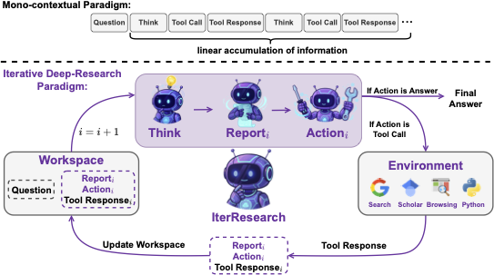
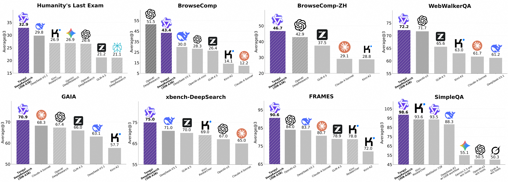

# WebResearcher: 迭代式深度研究智能体

<p align="center">
  
</p>

<p align="center">
  <strong>通过迭代综合实现无界推理</strong>
</p>

<p align="center">
  <a href="https://pypi.org/project/webresearcher/"></a>
  <a href="https://pypi.org/project/webresearcher/"></a>
  <a href="https://github.com/shibing624/WebResearcher/blob/main/LICENSE"></a>
  <a href="https://arxiv.org/abs/2509.13309"></a>
  <a href="https://pepy.tech/project/webresearcher"></a>
</p>

<p align="center">
  <a href="./README.md">English</a> | <a href="./README_zh.md">简体中文</a>
</p>

---

## 🌟 核心亮点

- 🧠 **迭代深度研究**: 通过周期性综合防止上下文溢出的新型范式
- 🔄 **无界推理**: 通过演化报告实现几乎无限的研究深度
- 🛠️ **丰富工具生态**: 网页搜索、学术论文、代码执行、文件解析
- 🎯 **生产就绪**: 零外部 Agent 框架依赖，完全自包含
- ⚡ **高性能**: 异步优先设计，智能 Token 管理，强大的错误处理
- 🎨 **易于使用**: 简洁的 CLI、清晰的 Python API、丰富的示例

## 📖 简介

**WebResearcher** 是基于 **IterResearch 范式**构建的自主研究智能体，旨在模拟专家级别的研究工作流。与遭受上下文溢出和噪音累积困扰的传统 Agent 不同，WebResearcher 将研究分解为离散的轮次，并进行迭代综合。

### 传统 Agent 的问题

当前的开源研究 Agent 依赖于**单上下文、线性累积**模式：

1. **🚫 认知工作空间窒息**: 不断膨胀的上下文限制了深度推理能力
2. **🚫 不可逆的噪音污染**: 错误和无关信息不断累积
3. **🚫 缺乏周期性综合**: 无法暂停以提炼、重新评估和战略性规划

### WebResearcher 的解决方案

WebResearcher 实现了 **IterResearch 范式**，每轮通过**单次 LLM 调用**同时生成：

- **Think（思考）**: 内部推理和分析
- **Report（报告）**: 综合所有发现的更新研究摘要
- **Action（行动）**: 工具调用或最终答案

这种**一步式方法**（相比传统的两步式"思考→行动→综合"）带来了：
- ⚡ **速度提升 50%** - 每轮只需一次 LLM 调用而非两次
- 💰 **成本降低 40%** - 减少 Token 使用量
- 🧠 **推理更优** - Think、Report 和 Action 在统一上下文中生成

这实现了**无界的研究深度**，同时保持精简、聚焦的认知工作空间。

<p align="center">
  
  <br>
  <em>图：单上下文范式（上）vs. 迭代深度研究范式（下）</em>
</p>

## 🏗️ 架构

### 核心组件

**IterResearch 范式 - 每轮单次 LLM 调用：**

```python
第 i 轮:
┌─────────────────────────────────────────────────────────┐
│  工作空间状态: (问题, 报告_{i-1}, 结果_{i-1})              │
└─────────────────────────────────────────────────────────┘
                          ↓
┌─────────────────────────────────────────────────────────┐
│  单次 LLM 调用 → 同时生成三部分：                          │
│  ├─ <think>: 分析当前状态                                │
│  ├─ <report>: 综合所有发现的更新报告                      │
│  └─ <tool_call> 或 <answer>: 下一步行动                  │
└─────────────────────────────────────────────────────────┘
                          ↓
┌─────────────────────────────────────────────────────────┐
│  如果是 <tool_call>: 执行工具                             │
│  如果是 <answer>: 返回最终答案                            │
└─────────────────────────────────────────────────────────┘
                          ↓
           使用更新后的报告和工具结果进入下一轮
```

**核心优势**: 报告在决定下一步行动*之前*就已完成综合，确保在统一上下文中进行连贯推理。

### 可用工具

| 工具 | 描述 | 使用场景 |
|------|------|----------|
| `search` | 通过 Serper API 的 Google 搜索 | 通用网页信息 |
| `google_scholar` | 学术论文搜索 | 科研文献查询 |
| `visit` | 网页内容提取 | 深度内容分析 |
| `PythonInterpreter` | 沙盒代码执行 | 数据分析、计算 |
| `parse_file` | 多格式文件解析器 | 文档处理 |

## 🚀 快速开始

### 安装

```bash
pip install webresearcher
```

### 基础使用

```bash
# 设置 API 密钥
export OPENAI_API_KEY="your_key"
export SERPER_API_KEY="your_key"

# 运行研究查询
webresearcher "刘翔破纪录时候是多少岁?"
```

### Python API

```python
import asyncio
from webresearcher import WebResearcherAgent

# 配置
llm_config = {
    "model": "gpt-4o",
    "generate_cfg": {"temperature": 0.6}
}

# 创建 Agent
agent = WebResearcherAgent(
    llm_config=llm_config,
    function_list=["search", "google_scholar", "PythonInterpreter"]
)

# 开始研究
async def main():
    result = await agent.run("您的研究问题")
    print(result['prediction'])

asyncio.run(main())
```

## 📚 高级用法

### 测试时扩展 (TTS)

对于需要最高准确性的关键问题，使用 TTS 模式（3-5倍成本）：

```bash
webresearcher "复杂问题" --use-tts --num-agents 3
```

```python
from webresearcher import TestTimeScalingAgent

agent = TestTimeScalingAgent(llm_config, function_list)
result = await agent.run("复杂问题", num_parallel_agents=3)
```

### 自定义工具

通过继承 `BaseTool` 创建您自己的工具：

```python
from webresearcher import BaseTool, WebResearcherAgent, TOOL_MAP

class MyCustomTool(BaseTool):
    name = "my_tool"
    description = "工具功能描述"
    parameters = {"type": "object", "properties": {...}}
    
    def call(self, params, **kwargs):
        # 您的工具逻辑
        return "结果"

# 注册并使用
TOOL_MAP['my_tool'] = MyCustomTool()
agent = WebResearcherAgent(llm_config, function_list=["my_tool", "search"])
```

查看 [examples/custom_agent.py](./examples/custom_agent.py) 获取完整示例。

### 批量处理

高效处理多个问题：

```python
from webresearcher import WebResearcherAgent

questions = ["问题 1", "问题 2", "问题 3"]
agent = WebResearcherAgent(llm_config)

for question in questions:
    result = await agent.run(question)
    print(f"Q: {question}\nA: {result['prediction']}\n")
```

查看 [examples/batch_research.py](./examples/batch_research.py) 获取高级批量处理示例。

### Python 解释器配置

`PythonInterpreter` 工具支持两种执行模式：

**1. 沙箱模式（生产环境推荐）：**
```bash
# 配置沙箱端点
export SANDBOX_FUSION_ENDPOINTS="http://your-sandbox-endpoint.com"
```

**2. 本地模式（自动降级）：**
- 当未配置 `SANDBOX_FUSION_ENDPOINTS` 时，代码在本地执行
- 适用于开发和测试
- ⚠️ **警告**：本地执行会在当前 Python 环境中运行代码

```python
from webresearcher import PythonInterpreter

# 如果配置了沙箱则使用沙箱，否则降级到本地执行
interpreter = PythonInterpreter()
result = interpreter.call({'code': 'print("Hello, World!")'})
```

详细示例请参考 [examples/python_interpreter_example.py](./examples/python_interpreter_example.py)。

### 日志管理

WebResearcher 提供了统一的日志管理系统，可以通过环境变量或编程方式控制日志级别：

**通过环境变量：**

```bash
# 运行前设置日志级别
export WEBRESEARCHER_LOG_LEVEL=DEBUG  # 选项：DEBUG, INFO, WARNING, ERROR, CRITICAL
webresearcher "你的问题"
```

**编程方式：**

```python
from webresearcher import set_log_level, add_file_logger

# 设置控制台日志级别
set_log_level("WARNING")  # 只显示警告和错误

# 添加文件日志，支持自动轮转
add_file_logger("research.log", level="DEBUG")

# 现在执行研究
agent = WebResearcherAgent(llm_config)
result = await agent.run("你的问题")
```

**文件日志功能：**
- 文件大小超过 10MB 时自动轮转
- 保留最近 7 天的日志
- 自动压缩旧日志为 .zip 格式

详细使用方法请参考 [examples/logging_example.py](./examples/logging_example.py) 和 [docs/logging_guide.md](./docs/logging_guide.md)。

## 🎯 功能特性

### 核心特性

- ✅ **迭代综合**: 通过周期性报告更新防止上下文溢出
- ✅ **无界深度**: 几乎无限的研究轮次
- ✅ **智能 Token 管理**: 自动上下文修剪和压缩
- ✅ **强大的错误处理**: 重试逻辑、回退策略、强制答案生成
- ✅ **异步支持**: 非阻塞 I/O 提升性能
- ✅ **类型安全**: 全面的类型提示

### 工具特性

- ✅ **网页搜索**: 通过 Serper 集成 Google 搜索
- ✅ **学术搜索**: Google Scholar 查询研究论文
- ✅ **网页抓取**: 智能内容提取
- ✅ **代码执行**: 沙盒 Python 解释器
- ✅ **文件处理**: 支持 PDF、DOCX、CSV、Excel 等
- ✅ **可扩展**: 轻松创建自定义工具

### 生产特性

- ✅ **零框架锁定**: 无 qwen-agent 等类似依赖
- ✅ **轻量级**: 仅 59KB wheel 包
- ✅ **文档完善**: 全面的文档字符串和示例
- ✅ **CLI + API**: 支持命令行和 Python 调用
- ✅ **可配置**: 丰富的配置选项
- ✅ **日志记录**: 使用 loguru 的丰富日志

## 📊 性能表现

基于论文的评估结果：

- **HotpotQA**: 在多跳推理任务上表现优异
- **Bamboogle**: 在复杂事实问题上表现出色
- **上下文管理**: 即使 50+ 轮后仍保持精简的工作空间
- **准确性**: 与基线 Agent 相当或超越

<p align="center">
  
</p>

## 🔧 配置

### 环境变量

```bash
# 必需
OPENAI_API_KEY=sk-...              # OpenAI API 密钥
SERPER_API_KEY=...                 # Serper API（Google 搜索）

# 可选
OPENAI_BASE_URL=https://...        # 自定义 OpenAI 端点
JINA_API_KEY=...                   # Jina AI（网页抓取）
SANDBOX_FUSION_ENDPOINTS=...       # 代码执行沙盒
MAX_LLM_CALL_PER_RUN=50           # 每次研究的最大迭代次数
FILE_DIR=./files                   # 文件存储目录
```

### LLM 配置

```python
llm_config = {
    "model": "gpt-4o",              # 或: o3-mini, gpt-4-turbo 等
    "generate_cfg": {
        "temperature": 0.6,          # 采样温度 (0.0-2.0)
        "top_p": 0.95,              # 核采样
        "presence_penalty": 1.1,     # 重复惩罚
        "model_thinking_type": "enabled"  # enabled|disabled|auto
    },
    "max_input_tokens": 32000,      # 上下文窗口限制
    "llm_timeout": 300.0,           # LLM API 超时（秒）
    "agent_timeout": 600.0,         # Agent 总超时（秒）
}
```

## 📝 示例

查看 [examples/](./examples/) 目录获取完整示例：

- **[basic_usage.py](./examples/basic_usage.py)** - WebResearcher 入门
- **[batch_research.py](./examples/batch_research.py)** - 批量处理多个问题
- **[custom_agent.py](./examples/custom_agent.py)** - 创建自定义工具

## 🧪 测试

```bash
# 安装开发依赖
pip install -e ".[dev]"

# 运行测试
pytest

# 运行覆盖率测试
pytest --cov=webresearcher
```

## 📚 文档

- [示例代码](./examples/) - 使用示例和教程
- [更新日志](./CHANGELOG.md) - 版本历史和更新
- [贡献指南](./CONTRIBUTING.md) - 如何贡献代码
- [发布指南](./RELEASE.md) - 维护者发布流程

## 🤝 参与贡献

我们欢迎各种形式的贡献！

贡献方式：
- 🐛 报告 Bug
- 💡 提出新功能建议
- 📝 改进文档
- 🔧 提交 Pull Request

详细指南请查看 [CONTRIBUTING.md](./CONTRIBUTING.md)。

## 📧 联系方式

- **GitHub Issues**: [报告问题或功能请求](https://github.com/shibing624/WebResearcher/issues)
- **邮箱**: xuming624@qq.com
- **微信**: xuming624（备注：姓名-公司-NLP）

<p align="center">
  
</p>

## 🌟 Star 历史

[](https://star-history.com/#shibing624/WebResearcher&Date)

## 📑 引用

如果您在研究中使用了 WebResearcher，请引用：

```bibtex
@misc{qiao2025webresearcher,
    title={WebResearcher: Unleashing unbounded reasoning capability in Long-Horizon Agents}, 
    author={Zile Qiao and Guoxin Chen and Xuanzhong Chen and Donglei Yu and Wenbiao Yin and Xinyu Wang and Zhen Zhang and Baixuan Li and Huifeng Yin and Kuan Li and Rui Min and Minpeng Liao and Yong Jiang and Pengjun Xie and Fei Huang and Jingren Zhou},
    year={2025},
    eprint={2509.13309},
    archivePrefix={arXiv},
    primaryClass={cs.CL},
    url={https://arxiv.org/abs/2509.13309}, 
}
```

## 📄 许可证

本项目采用 [Apache License 2.0](./LICENSE) 许可证 - 可免费用于商业用途。

## 🙏 致谢

本项目受以下研究启发并在此基础上构建：

- **[WebResearcher 论文](https://arxiv.org/abs/2509.13309)** by Qiao et al.
- **[Alibaba-NLP/DeepResearch](https://github.com/Alibaba-NLP/DeepResearch)** - 原始研究实现

特别感谢论文作者在迭代研究范式上的开创性工作！

---

<p align="center">
  用 ❤️ 制作 by <a href="https://github.com/shibing624">shibing624</a>
</p>

